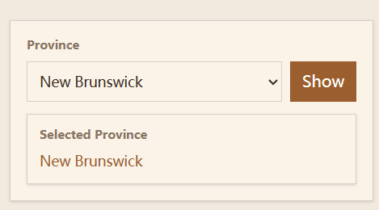
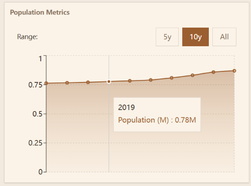
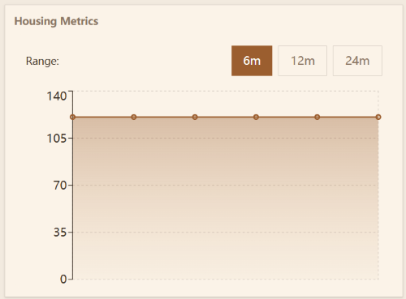

# Where To Live Canada

## Overview
An interactive data-driven web application that helps users explore and compare Canadian provinces and territories using official **Statistics Canada** data.
The app visualizes **population trends**, **cost of living (CPI)**, **labour market indicators**, and **housing price indexes** to support informed relocation decisions.

## Live Demo
https://where-to-live-canada.vercel.app

## Screenshots






## Features

- **Population Trends** — Historical population data by province/territory
- **Labour Market** — Employment and unemployment rates
- **Housing Prices** — New Housing Price Index
- **Cost of Living** — Consumer Price Index (CPI)
- **Province Selector** — Apply one selection across all charts
- **Real-time API** — Data fetched live from Statistics Canada

## Tech Stack

### Frontend
- **React** (Vite)
- **Tailwind CSS**
- **Recharts** (data visualization)
- Deployed on **Vercel**

### Backend
- **FastAPI**
- **Python**
- **Requests**
- Statistics Canada Web Data Service (WDS) API
- Deployed on **Render**

## Architecture Overview
```yaml
React (Vercel)
   |
   |  HTTP Requests
   v
FastAPI Backend
   |
   |  POST Requests
   v
Statistics Canada WDS API
```
- The frontend selects a province
- Province names are mapped to **StatCan member IDs**
- Backend translates member IDs into StatCan cube coordinates
- Data is normalized and returned as JSON for charts

## API Endpoints
### Base URL:
```bash
/api/statcan
```

### Population
```bash
GET /population?memberId=1&latestN=10
```

### Consumer Price Index
```bash
GET /CPI?memberId=14&latestN=6
```

### Labour Market
```bash
GET /labor?memberId=7&umn=9&latestN=6
```
- umn=9 → Employment rate
- umn=7 → Unemployment rate

### Housing Prices
```bash
GET /housing?memberId=17&latestN=6
```

## Local Development
### 1. Clone the Repository
```bash
git clone https://github.com/your-username/where-to-live-canada.git
cd where-to-live-canada
```

### 2. Frontend Setup
```bash
cd frontend
npm install
npm run dev
```
Runs on:
```arduino
http://localhost:5173
```

### 3. Backend Setup
```bash
cd backend
python -m venv venv
source venv/bin/activate  # Windows: venv\Scripts\activate
pip install -r requirements.txt
uvicorn app.main:app --reload
```
Runs on:
```arduino
http://localhost:8000
```

## Data Source
All data is sourced from **Statistics Canada** via their official Web Data Service:
- Population estimates
- Consumer Price Index
- Labour Force Survey
- New Housing Price Index
Data accuracy and availability are subject to StatCan updates.

## Roadmap / Future Improvements
- Trend comparisons between provinces
- City-level data
- Composite “livability” score
- Data export (CSV)
- Dark mode toggle
